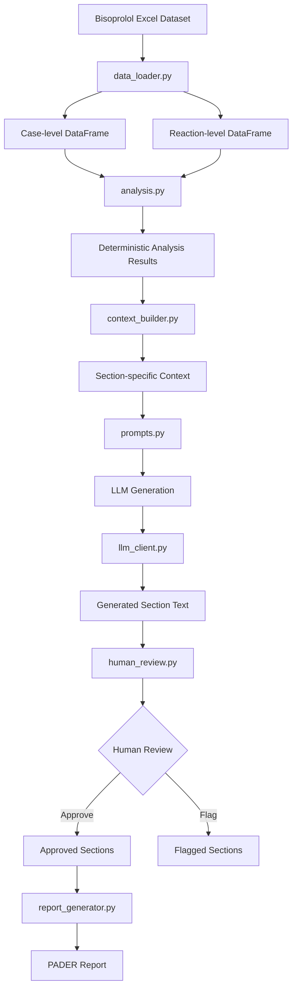

# Architecture

## Architecture Overview

The system separates deterministic data processing from LLM-based narrative generation.

- `data_loader.py` loads and prepares the source data.
- `analysis.py` performs deterministic calculations.
- `context_builder.py` creates section-specific evidence.
- `prompts.py` controls the narrative generation instructions.
- `llm_client.py` handles the LLM call.
- `human_review.py` provides human approval/flagging.
- `report_generator.py` assembles the final report.